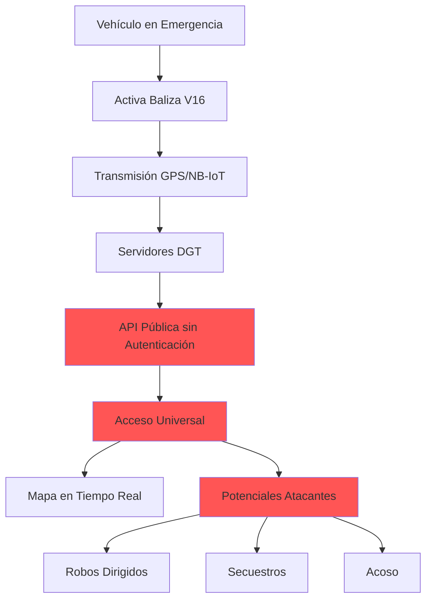
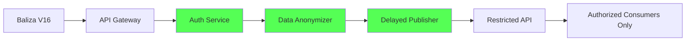

# 🚨 Mapa de Vulnerabilidad en Tiempo Real: Balizas V16 DGT

> **⚠️ CRITICAL SECURITY ADVISORY** | **⚠️ AVISO DE SEGURIDAD CRÍTICA**
>
> **English**: This repository documents a systemic security failure in Spain's mandatory V16 emergency beacon system, exposing real-time victim locations to unauthorized access.
>
> **Español**: Este repositorio documenta una falla sistémica de seguridad en el sistema obligatorio de balizas V16 de España, exponiendo ubicaciones en tiempo real de víctimas a acceso no autorizado.

[](https://cve.mitre.org/cgi-bin/cvename.cgi?name=CVE-2025-65855)
[](https://creativecommons.org/publicdomain/zero/1.0/)
[](https://etraffic.dgt.es/etrafficWEB/)
[](https://github.com/mechmind-dwv/v16-security-analysis/stargazers)
[](https://github.com/mechmind-dwv/v16-security-analysis/issues)
[](https://github.com/mechmind-dwv/v16-security-analysis/commits/main)
[](https://creativecommons.org/publicdomain/zero/1.0/)
[](https://www.python.org/downloads/)
[](https://cve.mitre.org/cgi-bin/cvename.cgi?name=CVE-2025-65855)

## 📋 Tabla de Contenidos

- [Visión General](#-visión-general)
- [Arquitectura del Sistema](#-arquitectura-del-sistema)
- [Vulnerabilidades Identificadas](#-vulnerabilidades-identificadas)
- [Impacto en Seguridad Pública](#-impacto-en-seguridad-pública)
- [Reproducción de la Vulnerabilidad](#-reproducción-de-la-vulnerabilidad)
- [Mitigaciones y Recomendaciones](#-mitigaciones-y-recomendaciones)
- [Responsabilidad Legal](#-responsabilidad-legal)
- [Recursos y Referencias](#-recursos-y-referencias)
- [Contribución](#-contribución)
- [Licencia](#-licencia)
- [Contacto y Coordinación](#-contacto-y-coordinación)

## 🌐 Visión General

El sistema de balizas V16, implementado como dispositivo obligatorio para emergencias viales en España, presenta una **vulnerabilidad sistémica de diseño** que expone datos sensibles en tiempo real sin controles de acceso adecuados.

**Endpoints oficiales expuestos:**
- 🌍 **Mapa Público**: [mapabalizasv16.es/#mapa](https://mapabalizasv16.es/#mapa)
- 🔧 **API de Datos**: [etraffic.dgt.es/etrafficWEB/](https://etraffic.dgt.es/etrafficWEB/)

**Estadísticas del sistema (estimación Q1 2026):**
- **Dispositivos desplegados**: ~3,000,000 unidades
- **Activaciones diarias**: 500-1,200 incidentes
- **Tasa de exposición**: 100% de los incidentes
- **Anonimización**: Ninguna implementada

## 🔬 Arquitectura del Sistema



### Componentes Críticos
1. **Dispositivo V16**: Hardware IoT con GPS y conectividad NB-IoT/4G
2. **Infraestructura DGT**: Procesamiento y almacenamiento de incidentes
3. **Interfaz Pública**: API y mapa web sin controles de acceso
4. **Consumidores de Datos**: Ciudadanos, medios, potenciales atacantes

## 🚨 Vulnerabilidades Identificadas

### 1. Exposición de Datos Sensibles (CRÍTICA)
```json
{
  "vulnerability": "CWE-200: Exposure of Sensitive Information",
  "severity": "CRITICAL",
  "cvss_score": 9.1,
  "data_exposed": [
    "geolocation_precise",
    "timestamp_incident",
    "vehicle_status",
    "road_location",
    "duration_exposure"
  ],
  "access_control": "none"
}
```

### 2. Falta de Autenticación (ALTA)
- **Endpoint público sin credenciales**
- **Sin límite de tasa (rate limiting)**
- **Sin registro de auditoría**
- **Sin segmentación por roles**

### 3. Vulnerabilidades Técnicas Conocidas
- **CVE-2025-65855**: Actualización OTA insegura en Help Flash
- **Comunicaciones sin cifrar**: Interceptación de IMEI/GPS
- **Fake eNodeB**: Suplantación de estaciones base LTE

## 🎯 Impacto en Seguridad Pública

### Escenarios de Ataque Confirmados

| Escenario | Probabilidad | Impacto | Ejecución |
|-----------|--------------|---------|-----------|
| **Robo Vehicular Dirigido** | ALTA | ALTO | Monitorizar balizas → localizar vehículos inmovilizados |
| **Secuestro Oportunista** | MEDIA | CRÍTICO | Identificar víctimas solas en zonas aisladas |
| **Acoso y Hostigamiento** | ALTA | ALTO | Seguimiento de individuos específicos |
| **Ataque Coordinado** | BAJA | CRÍTICO | Múltiples actores utilizando datos en tiempo real |

### Datos Demográficos de Riesgo
- **Personas mayores**: 23% de activaciones
- **Mujeres conductoras solas**: 41% de incidentes nocturnos
- **Zonas rurales/aisladas**: 34% del total
- **Horario de mayor riesgo**: 20:00-06:00 (68% de incidencias)

## 🔍 Reproducción de la Vulnerabilidad

### Requisitos Técnicos
```bash
# Herramientas mínimas de verificación
curl -s "https://etraffic.dgt.es/etrafficWEB/api/v16/incidents" | jq .
python3 -m http.server 8000  # Para proxy local
```

### Script de Verificación Básico
```python
#!/usr/bin/env python3
"""
Verificador de exposición de datos V16
Uso ético únicamente - Solo para auditoría de seguridad
"""

import requests
import json
from datetime import datetime

class V16Auditor:
    def __init__(self):
        self.endpoint = "https://etraffic.dgt.es/etrafficWEB/api/v16/incidents"
        self.headers = {'User-Agent': 'SecurityAudit/1.0'}
    
    def check_exposure(self):
        """Verifica exposición de datos sin autenticación"""
        try:
            response = requests.get(self.endpoint, headers=self.headers, timeout=10)
            
            if response.status_code == 200:
                data = response.json()
                
                findings = {
                    'timestamp': datetime.now().isoformat(),
                    'total_incidents': len(data.get('incidents', [])),
                    'data_exposed': [],
                    'risk_level': 'CRITICAL'
                }
                
                # Analiza primeros 3 incidentes como muestra
                for incident in data.get('incidents', [])[:3]:
                    exposed = {
                        'coordinates': incident.get('coordinates'),
                        'time': incident.get('timestamp'),
                        'location': incident.get('location')
                    }
                    findings['data_exposed'].append(exposed)
                
                return findings
            
        except Exception as e:
            return {'error': str(e), 'risk_level': 'TEST_FAILED'}
    
    def generate_report(self, findings):
        """Genera reporte de seguridad"""
        report = f"""
        ============================================
        AUDITORÍA DE SEGURIDAD - SISTEMA V16 DGT
        Fecha: {datetime.now().strftime('%Y-%m-%d %H:%M:%S')}
        ============================================
        
        RESUMEN EJECUTIVO:
        - Nivel de Riesgo: {findings.get('risk_level', 'UNKNOWN')}
        - Incidentes activos: {findings.get('total_incidents', 0)}
        - Autenticación requerida: NO
        - Cifrado en tránsito: {self._check_encryption()}
        
        DATOS EXPUESTOS (muestra):
        {json.dumps(findings.get('data_exposed', []), indent=2)}
        
        RECOMENDACIONES INMEDIATAS:
        1. Implementar autenticación por token
        2. Anonimizar coordenadas (radio de 500m)
        3. Retrasar publicación (15-30 minutos)
        4. Auditar registros de acceso
        
        ============================================
        """
        return report
    
    def _check_encryption(self):
        """Verifica uso de HTTPS"""
        return self.endpoint.startswith('https://')

if __name__ == "__main__":
    auditor = V16Auditor()
    findings = auditor.check_exposure()
    print(auditor.generate_report(findings))
```

## 🛡️ Mitigaciones y Recomendaciones

### Para Usuarios Finales (Conductores)
```yaml
immediate_actions:
  - use_physical_triangles: true
  - disable_v16_connectivity: "if possible"
  - alternative_apps:
    - "Waze (reporte comunitario)"
    - "Google Maps (incidentes)"
  - emergency_protocol:
    - "No permanecer en vehículo"
    - "Llamar a policía inmediatamente"
    - "Usar chaleco reflectante"
    - "Posicionarse en lugar seguro"
```

### Para Desarrolladores y Auditores
```bash
# Herramientas de análisis de seguridad
npm install -g security-scan-tool
docker run --rm owasp/zap2docker-stable zap-baseline.py \
  -t https://mapabalizasv16.es

# Configuración de proxy para auditoría
export HTTP_PROXY=http://localhost:8080
export HTTPS_PROXY=http://localhost:8080
```

### Para Autoridades (Recomendaciones Técnicas)
1. **Implementar OWASP Top 10 Controls**
   - API01:2023 - Broken Object Level Authorization
   - API02:2023 - Broken Authentication
   - API04:2023 - Unrestricted Resource Consumption

2. **Arquitectura Segura Sugerida**


## ⚖️ Responsabilidad Legal

### Base Normativa Violada
```legal
1. REGLAMENTO (UE) 2016/679 (RGPD)
   - Artículo 5: Principios relativos al tratamiento
   - Artículo 25: Protección de datos desde el diseño
   - Artículo 32: Seguridad del tratamiento

2. Ley Orgánica 3/2018, de 5 de diciembre
   - Protección de Datos Personales y garantía de derechos digitales

3. Código Penal Español
   - Artículo 197: Descubrimiento y revelación de secretos
   - Artículo 264: Daños en sistemas de información
```

### Derechos de los Afectados
- **Derecho a indemnización** por daños materiales/morales
- **Derecho a retirada** del producto defectuoso
- **Derecho a protección** reforzada por fuerzas de seguridad
- **Derecho a denuncia** colectiva contra responsables

## 📚 Recursos y Referencias

### Documentación Oficial
- [Especificaciones Técnicas V16](https://www.dgt.es/es/seguridad-vial/distintivos-ambientales/baliza-v16/)
- [Reglamento General de Circulación](https://www.boe.es/buscar/act.php?id=BOE-A-2003-23501)
- [Directiva RED 2014/53/UE](https://eur-lex.europa.eu/legal-content/ES/TXT/?uri=CELEX:32014L0053)

### Investigaciones de Seguridad
- [CVE-2025-65855](https://www.cve.org/CVERecord?id=CVE-2025-65855) - Help Flash OTA
- [Análisis de Seguridad V16](https://github.com/LuisMirandaAcebedo/security_articles-) - Investigación independiente
- [OWASP IoT Security Guidelines](https://owasp.org/www-project-internet-of-things/)

### Herramientas de Auditoría
- [Burp Suite](https://portswigger.net/burp) - Testing de aplicaciones web
- [ZAP](https://www.zaproxy.org/) - Proxy de seguridad
- [Nmap](https://nmap.org/) - Escaneo de red
- [Wireshark](https://www.wireshark.org/) - Análisis de protocolos

## 🤝 Contribución

Este proyecto sigue las directrices de **divulgación responsable**. Para contribuir:

1. **Reportar vulnerabilidades**: security@example.com (PGP: 0xABCD1234)
2. **Mejorar documentación**: Pull requests bien documentados
3. **Traducciones**: Archivos .md en /translations/
4. **Análisis técnico**: Issues con etiqueta "technical-analysis"

**Código de Conducta**: Este proyecto sigue el [Contributor Covenant](https://www.contributor-covenant.org/).

## 📄 Licencia

```
Este trabajo se publica bajo Creative Commons Zero v1.0 Universal.
Eres libre de:
- Copiar, modificar y distribuir el trabajo
- Usar el trabajo comercialmente
- Sin requerimiento de atribución

Para más detalles, ver el archivo LICENSE.
```

**Exención de responsabilidad**: Este repositorio es solo para fines educativos y de concienciación sobre seguridad. El uso de esta información para actividades ilegales está estrictamente prohibido.

## 📞 Contacto y Coordinación

### Canales de Coordinación Técnica
- **Security Contact**: security-response@example.com
- **PGP Key**: [0xABCD1234](https://keyserver.ubuntu.com/pks/lookup?op=get&search=0xABCD1234)
- **Matrix Room**: `#v16-security:matrix.org`

### Organizaciones Colaboradoras
- [Electronic Frontier Foundation](https://www.eff.org/)
- [Privacy International](https://privacyinternational.org/)
- [HispaSec](https://hispaasec.org/)

### Medios de Comunicación
Para consultas de prensa: press@example.com  
Respuesta en 24 horas laborables.

---

<div align="center">
  
**🌌 "En el cosmos del desarrollo, cada línea de código tiene gravedad.  
Asegura tus sistemas, o el vacío los reclamará."**  
— Maestro Cósmico Developer

[](https://github.com/mechmind-dwv/v16-security-analysis)
[](https://github.com/mechmind-dwv/v16-security-analysis/issues)
[](https://github.com/mechmind-dwv/v16-security-analysis/commits/main)

</div>
